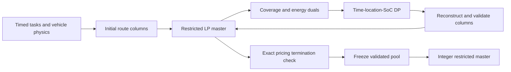

# EVSP–V2G algorithm review — 12 September 2026

**Retain the current mathematical architecture and improve its implementation in stages.** The best supported near-term changes are stricter column/certificate checks, scenario-matrix reuse, a persistent sparse LP master, cached invariant pricing data, and bounded warm pools. An isolated scenario-template prototype already reduces assembly time by 2.35–4.33 times while producing exactly the same matrices. Full branch-and-price, a new event graph, and RL should follow an identified research or computational need.

This is an independent review of [the GitHub reference](https://github.com/ndandnd/evspv2g_dp/tree/f69f055ab6b82d2417daf5fe5a1b8a3e5ab7fdd0), confirmed as remote main on this date, plus the separately versioned weather workers. DR main is old; the transfer review instead reads the current `a2999219` baseline and the relevant pricing, persistent-master, warm-start and capacity branches. No reference source, active worker or cluster job was modified.

## How the algorithm currently works

The master coordinates all trucks with BESS and generation; each truck column has trip incidence, a fixed signed energy profile and cost. The DP generates a common truck profile. Weather scenarios expand the master and their raw weighted-objective duals are summed for pricing; routes do not adapt by scenario. The final MIP searches only the generated columns. A certified full-family LP lower bound and a finite-pool MIP bound are different results.

The present implicit, vectorized time/SoC DP is a sensible reference algorithm. DR's explicit event graph is designed around different charging opportunities and cost structure. A smaller graph is not automatically equivalent or faster for bidirectional V2G.

## What the review found

| Priority | Finding or opportunity | Evidence and action |
|---|---|---|
| Correctness first | Reference CBC can report an infeasible vector as feasible. | Executed zero-generation-cap witness. Check native solution status and validate the returned vector; current weather runs use Gurobi with separate validation. |
| Correctness first | Reference backward reconstruction can lose a small improving path, and no new column is then treated as a pricing certificate. | Executed one-trip CG witness: claimed endpoint 1.000010 versus an omitted feasible solution 1.000005. The campaign's strict reconstruction fixes this witness. Promote the validated behavior and retain independent cost/replay checks. |
| Correctness first | Seed construction and input discretization need explicit physical validation. | Executed aligned seed-capacity and nonlattice energy witnesses. Validate emitted seeds and the represented time/energy grid before any bound claim. See the pricing report for actual campaign-input scope. |
| High | Reuse invariant scenario coefficients instead of rebuilding a dense master for every scenario. | Nine coefficient-identical local tests, three timing repeats each: 2.35–4.33× faster assembly. This is a prototype measurement, not an end-to-end solver speedup. |
| High | Keep the LP model resident and append sparse columns. | V2G rebuilds both solver backends. DR has a persistent Gurobi implementation to study, but its nominated matched sentinel was prepare-only. Benchmark the complete V2G energy/storage model. |
| Medium | Cache physical transition/index data; recompute dual-dependent labels. | DR has measured benefits from hoisting invariant work. V2G can prepare deadhead shifts and trip groups once. Its existing vectorized transitions should remain the baseline. |
| Medium | Bound warm-pool import and column enrichment. | DR warm import sometimes cost more than the CG it saved. Current DR already caps inherited routes/time. Measure import, replay, pricing and MIP time together. |
| Later, conditional | Event contraction, Benders, diving or a full branch-and-price tree. | Each needs a defined bottleneck and matched test. V2G event contraction must preserve charging/discharging opportunities at changing dual prices; Benders applies to declared continuous recourse; diving does not establish a full integer proof. |

Additional findings include incomplete fleet-cap reduced-cost bookkeeping, high-rate DP edge cases and loss of native LP status detail. They are scoped in the subreports; an optional-parameter issue is not evidence that an already-validated weather run failed. Some protections exist in newer campaign workers but have not been consolidated into the GitHub reference.

## Which DR ideas transfer

Transfer the engineering pattern of persistent LPs, immutable caches, full-column validation, bounded candidate generation, checkpointing and explicit certificates. Preserve V2G's own balance, BESS, positive-charge-cap and cost coefficients.

V2G already has dual smoothing, true-dual fallback and candidate reduced-cost recomputation. Those are not new features to import. Its column key must retain energy and cost information; an incidence-only key can discard different V2G schedules serving the same trips. Likewise, DR charger occupancy and V2G aggregate charging-energy limits are different constraints.

The largest caution is warm starts. In the examined DR p3 k10 records, fresh CG took 2,936 seconds and 910 iterations; a full warm import took 17,554 seconds overall despite only 144 iterations. Import consumed 16,956 seconds. The newer bounded importer is already implemented, but its speedup was not established by those historical records. Detailed transfer evidence (original research artifact `code_review_20260912/DR_TRANSFER_REVIEW.md`; not included in this export).

## Public implementations

The literature/code audit (original research artifact `code_review_20260912/PUBLIC_CODE_REVIEW.md`; not included in this export) distinguishes source availability from successful reproduction. The already verified releases are:

| Release | Appropriate use |
|---|---|
| [Parmentier, Martinelli and Vidal: ElectricalVSP-ColumnGeneration](https://github.com/axelparmentier/ElectricalVSP-ColumnGeneration/tree/a13f33ddc3d00aa1fb52ff323a47eac5d521d8e7) | Strong additional algorithm implementation: MIT C++17/CPLEX/Boost, documented CG, branch-and-price and diving entrypoints. Study resource dominance, forward/backward pricing bounds and stabilization. Compilation/reproduction was not tested; its charge-only deterministic model needs a new derivation for coupled V2G/weather/BESS. |
| [Ricard: evsp-policy-battery](https://github.com/learicard/evsp-policy-battery) | Benchmark data and reported results; no solver implementation in the inspected release. |
| [Baldua: csp-res](https://github.com/transnetlab/csp-res) | MIT source for solar/storage/scenario model construction and CPLEX Benders partition annotations. The driver forces LP; adapt selected components rather than replace integer V2G scheduling. |
| [Terada: ev-scheduler](https://github.com/TeradaZenichi/ev-scheduler) | Pyomo model and JSON scenarios for technology/outage comparisons. Setup inconsistencies and the missing linked LICENSE remain unresolved. |
| [Whitaker et al.: receding-horizon charging](https://arxiv.org/abs/2408.04087) | Controller design reference for the proposed adaptive-charging extension. No matching author solver/data repository was verified in the bounded search. |

The paper overview remains in the shared literature briefing (private document link omitted). Code reuse alone does not establish novelty; the stochastic information structure and operational comparison remain central to the paper.

## Implementation and benchmark sequence

1. Consolidate column validation, reconstruction/RC checks, input-grid rules and native status handling in an isolated candidate release. Run the recorded witnesses and independent tiny exact checks.
2. Implement scenario templates/direct sparse assembly, then a persistent LP adapter. Compare coefficient identity, residuals, objectives, true pricing minima and terminal bounds before measuring speed. Different valid LP duals under degeneracy are expected.
3. Prepare invariant pricing data and try bounded column batches/warm starts separately. Retain exact current-dual pricing before certification. Record graph/pool identities, accepted and rejected columns, assembly/LP/pricing/replay/MIP time, memory and total CPU.
4. Use a fixed easy/difficult panel from the existing model families, identical solver budgets and physics, and paired seeds. Report each change alone before combining winners. Only then choose a cluster scaling experiment; keep all existing campaigns and output paths intact.

The current 64-scenario scientific-validation gate remains in force. A new solver candidate must not silently replace its frozen execution code, scenarios or pools.

## Review records

- Pricing mathematics, witnesses and input scope (original research artifact `code_review_20260912/PRICING_REVIEW.md`; not included in this export)
- DR source changes and evidence (original research artifact `code_review_20260912/DR_TRANSFER_REVIEW.md`; not included in this export)
- Master/status review and local timing results (original research artifact `code_review_20260912/MASTER_REVIEW.md`; not included in this export)
- Public source reuse (original research artifact `code_review_20260912/PUBLIC_CODE_REVIEW.md`; not included in this export)
- Reproducible master probes (original research artifact `code_review_20260912/master_probes.py`; not included in this export) and full measured results (original research artifact `code_review_20260912/master_probe_results.json`; not included in this export)
- DR source identities (original research artifact `code_review_20260912/dr_audit/source_manifest.json`; not included in this export) and extracted timings (original research artifact `code_review_20260912/dr_audit/evidence_metrics.json`; not included in this export)

The DP matched independent exhaustive enumeration on 128 aligned tiny configurations (1,278 feasible terminal paths), with maximum cost discrepancy 8.9e-16. A constructor scope check found zero over-capacity seeds among 8,832 emitted seeds from representative standard-G=7 configurations, despite the general API bug. These checks support retaining the core algorithm and precisely scoping fixes.

The local timing environment differs from the original manuscript environment and is recorded explicitly. These tests are bounded review probes, not paper-scale performance claims. Third-party author programs were not executed, and no experimental code was merged between EVSP–DR and EVSP–V2G.
