# Section 8 gallery -- figures, tables, captions (draft)

Read top to bottom: this is the narrative order of the computational study.

## 8.1 Method: DP pricing replaces MILP pricing

| instance | original (MILP pricing, Gurobi) | this work (DP pricing, open-source) | notes |
|---|---|---|---|
| 450 tasks, eps=2.0 | 29,722 s (8.3 h), gap 0.71% | 45 s, gap 0.031% | 45,906 columns vs 1,354 |
| 280 tasks, eps=1.5 | 21,433 s, gap 0.94% | 13.1 s, gap 1.211% |  |
| pricing share of runtime | >95% (99.95% at 450 tasks) | 25-50% (master is now the bottleneck) |  |
| full 5-experiment suite | hours per instance | ~95 s total |  |
**Table 8.1.** Recreating the original scalability study under the revised model. The labeling-DP pricing oracle solves the same instances three orders of magnitude faster on open-source solvers, with tighter integrality gaps and ~30x fewer columns; the runtime bottleneck moves from pricing (>95% in the original) to the master LP. The original's reported slowdown for the relaxed energy level (eps=1.5) disappears: the DP's cost is fixed by the state space, not by route feasibility.

| evidence | test | result |
|---|---|---|
| implementation equivalence | three independent codebases, matched-granularity masters | LP optima identical to the digit: (70.0, 80.0, 78.0) and ladder (80, 110, 140, 152.8571, 170) (note the fractional 152.8571) |
| LP-solver independence | HiGHS vs Gurobi on shared pools, 160-1000 tasks | identical LP objectives in every instance |
| per-iteration checks | DP reduced cost vs master formula; battery DP vs exact LP; Bellman-Ford | <1e-6 each iteration; 2.3e-13; exact |
| head-to-head vs original code | fresh Gurobi run of the original repo, aligned master | 295.00 vs 296.50 = 0.5% (the original's final master prices batteries at bus cost; with the intended battery cost our model gives 237.10) |
| CBC vs Gurobi (practical note) | same pools, 1% gap target | 600 tasks: 27,127 s vs 29.6 s; 1000 tasks: 3,043 s vs 8.4 s -- commercial solver optional, affects waiting time only |
**Table 8.2.** The equivalence chain: given the same master problem (same objective, same constraints), column generation with the DP oracle reaches the same LP optimum as MILP pricing -- exactly where every detail is matched, and to 0.5% against a fresh run of the original code once its final-master battery-cost slip is accounted for. The LP value is the heuristic-free comparison; integer solutions and side metrics are degenerate near the optimum and legitimately differ between ~1%-gap runs.

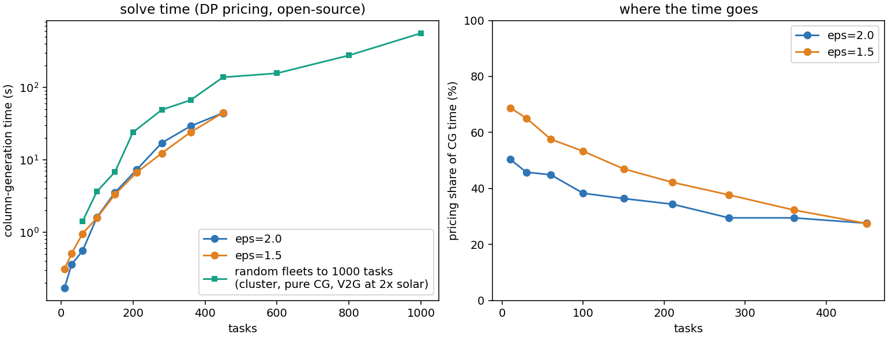

**Figure 8.1.** Column-generation solve time (left) and the share of it spent in pricing (right) on the original instance family, 10-450 tasks. With the labeling DP, pricing never exceeds half the (seconds-scale) runtime; in the original MILP-pricing implementation it exceeded 95% of an hours-scale runtime. The method's bottleneck becomes the restricted master LP -- exactly the component that Proposition 2's continuous-energy result keeps small. The teal series extends the picture to 1000 tasks with no additional runs, reusing the warm-start ladder of Fig 8.10 (random-fleet family, V2G at 2x solar, pure CG without enrichment, cluster hardware -- hence the separate label): even at 1000 tasks the full column generation completes in under ten minutes, and a log-log fit across the ladder puts the empirical growth near n^2.

## 8.2 Reproduction and the free-energy artifact

| tasks | schedule | original (published) | DP, free start | DP, cyclic (revised) |
|---|---|---|---|---|
| 20 | breaks | -158.59 / 12.33t |   -245.5 / 7t+9b |    137.9 / 13t+0b |
| 20 | uniform | -128.28 / 12.0t |   -306.1 / 8t+10b |    139.4 / 10t+0b |
| 60 | breaks | -60.61 / 30.67t |     34.8 / 22t+1b |    478.8 / 39t+0b |
| 60 | uniform | -29.29 / 25.67t |   -163.6 / 24t+5b |    493.9 / 30t+0b |
| 120 | breaks | -57.58 / 62.0t |    227.3 / 45t+0b |   1071.2 / 78t+0b |
| 120 | uniform | -6.06 / 55.0t |     -3.0 / 48t+0b |   1087.9 / 60t+0b |
**...and the cyclic model exports honestly once solar grows** (V2G, 60 tasks, same gallons metric):

| solar surplus | fuel (gal) | trucks | batteries |
|---|---|---|---|
| 3.7 MWh/day |   +351.5 | 30 | 1 |
| 16.8 MWh/day |    -36.4 | 30 | 11 |
| 30.9 MWh/day |   -445.5 | 30 | 25 |
**Table 8.3.** The original's Table 2 (fuel in gallons; negative = net energy export) next to this implementation run in the original's free-start setting and in the revised cyclic model. Free start reproduces the original's phenomena -- net export and stationary batteries -- because each vehicle's initial charge is free energy; the cyclic model prices that energy and the export vanishes. Every level difference between the columns is attributable to this single modeling choice (plus the original's documented final-master battery-cost slip). The companion table shows the honest counterpart of the original's net export: keep the cyclic constraint and grow the solar instead -- at 2x the fleet already exports (-36 gal/day) and at 3x it displaces the ENTIRE base fossil generation (-446 gal/day), every kWh of it paid for through the power balance.

**Fleet-attributable fossil fuel (gallons/day; negative = net export). Revised cyclic model, planning prices, V2G:**

| tasks \ surplus | 3.7 MWh/d | 10.3 MWh/d | 16.8 MWh/d | 23.7 MWh/d | 30.9 MWh/d | 38.0 MWh/d | 45.1 MWh/d |
|---|---|---|---|---|---|---|---|
| 20 | +48 | -148 | -348 | -450* | -446* | -430* | -430* |
| 40 | +211 | +18 | -182 | -388 | -446* | -430* | -430* |
| 60 | +373 | +173 | -24 | -233 | -446* | -430* | -430* |
| 80 | +508 | +311 | +120 | -94 | -308 | -430* | -430* |
| 100 | +685 | +485 | +289 | +80 | -138 | -353 | -430* |
| 120 | +823 | +622 | +429 | +215 | +0 | -218 | -418 |
| 140 | +1016 | +809 | +618 | +418 | +194 | -24 | -236 |
| 160 | +1133 | +927 | +739 | +530 | +318 | +103 | -112 |
| 180 | +1303 | +1097 | +911 | +720 | +509 | +289 | +73 |
| 200 | +1452 | +1242 | +1056 | +848 | +633 | +412 | +200 |
**Table 8.4.** The revised paper's own export table -- no free energy, no anchoring to the original's instances: fleet-attributable fossil (total generation minus the no-fleet baseline, in the gallons metric) for task counts 20-200 against solar surplus levels, all under the cyclic model at planning prices. The sign boundary traces the R-rule diagonally through the grid: a small fleet exports at modest solar while a large fleet needs abundant solar, because export begins where the surplus outruns the fleet's own charging appetite. Starred entries: fossil generation driven literally to zero (full displacement -- the zero-touching curves of Fig. 8.6).

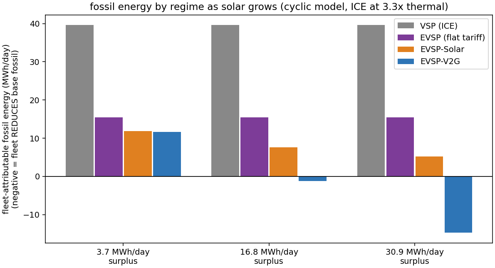

| solar surplus | regime | incremental fossil (MWh) | trucks | batteries |
|---|---|---|---|---|
| 3.7 MWh surplus | VSP (ICE) | +39.6 | 18 | 0 |
| 16.8 MWh surplus | VSP (ICE) | +39.6 | 18 | 0 |
| 30.9 MWh surplus | VSP (ICE) | +39.6 | 18 | 0 |
| 3.7 MWh surplus | EVSP (flat tariff) | +15.4 | 30 | 0 |
| 16.8 MWh surplus | EVSP (flat tariff) | +15.4 | 30 | 0 |
| 30.9 MWh surplus | EVSP (flat tariff) | +15.4 | 30 | 0 |
| 3.7 MWh surplus | EVSP-Solar | +11.9 | 30 | 0 |
| 16.8 MWh surplus | EVSP-Solar | +7.6 | 30 | 0 |
| 30.9 MWh surplus | EVSP-Solar | +5.2 | 42 | 0 |
| 3.7 MWh surplus | EVSP-V2G | +11.6 | 30 | 1 |
| 16.8 MWh surplus | EVSP-V2G | -1.2 | 30 | 11 |
| 30.9 MWh surplus | EVSP-V2G | -14.7 | 30 | 25 |
**Figure 8.2 (and table).** Fossil energy attributable to the fleet -- total generation minus the no-fleet baseline -- by regime and solar level, under the honest cyclic model with the measured 3.3x ICE drivetrain convention. At scarce solar the four regimes are ordered by efficiency alone; as the surplus grows, the solar step first erases the EV fleet's own fossil draw, and V2G then turns the fleet NEGATIVE: the vehicles displace base-load fossil they never consumed, an honest, fully-paid-for analogue of the original paper's net export. The flat-tariff EVSP column isolates how much of the electric fleet's advantage is drivetrain efficiency versus microgrid coupling.

## 8.3 Deployment conditions

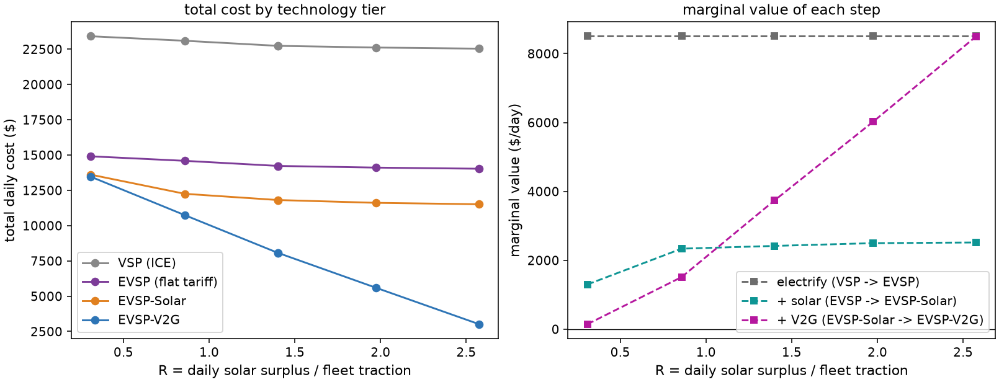

**Figure 8.3.** The technology ladder VSP -> EVSP (flat tariff) -> EVSP-Solar -> EVSP-V2G (60 tasks, EV truck premium 1.5x, drivetrain efficiency 3.3x, fuel $0.40/kWh). Left: total daily cost by tier as the solar surplus grows. Right: the three marginal values are nearly separable -- electrification's value is flat in R (it scales with fuel burned), the solar step (coordinating charging into the midday surplus) is worth money from the first surplus kWh and saturates once the fleet's traction is covered (R ~ 1), and V2G switches on near R ~ 1 and keeps growing where the solar step saturates: bidirectionality is what monetizes surplus beyond the fleet's own needs.

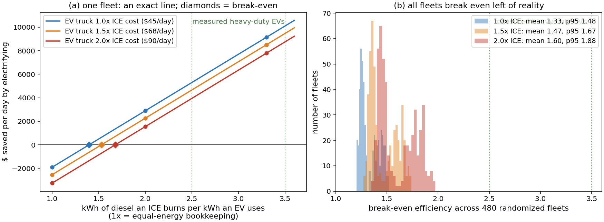

**Figure 8.4.** The electrification decision. Left (mechanism, one fleet): fuel enters the objective linearly, so the value of replacing ICE trucks with plain EVs is an exact straight line in the drivetrain-efficiency ratio -- how many kWh of diesel an ICE burns to do the work an EV does on one kWh (an engine-physics number; nothing to do with solar). Diamonds mark break-even. Right (robustness): the break-even distribution across 240 randomized fleets -- 30-120 tasks, heterogeneous 50-250 kWh duties, breaks or full-day schedules -- at EV daily costs of 1.0x / 1.5x / 2.0x the ICE truck's (the ICCT reports battery-electric truck prices at 1.3-2.4x diesel, so the sampled range is realistic). Means 1.33/1.47/1.60, 95th percentiles 1.48/1.67/1.88, single worst fleet 1.97: the ENTIRE distribution lies below the measured 2.5-3.5x band (green), so electrification pays for every sampled fleet under honest energy accounting -- and never pays under the equal-energy convention (1x). The solar profile contributes zero width by construction (both regimes are solar-blind; verified to the cent).

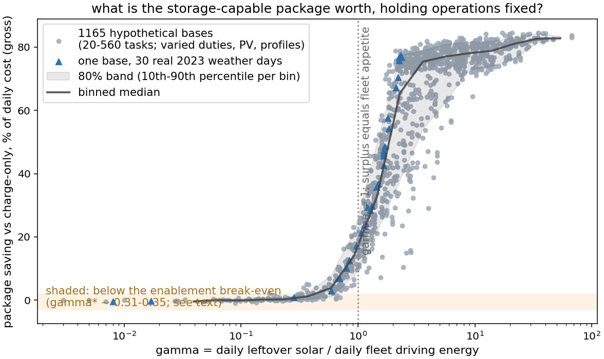

**Figure 8.5.** Each dot is one hypothetical base -- a specific fleet size (20-560 daily tasks), task energy (50-250 kWh), PV size, network, and schedule -- solved to optimality TWICE, with V2G allowed and charge-only; its height is the total-daily-cost saving V2G delivered. The x-coordinate is R = daily leftover solar divided by the fleet's daily driving energy: 'solar per unit of fleet appetite'. The same 16.8 MWh surplus is a feast for a fleet that drives on 4 MWh and irrelevant to one that needs 24, so raw MWh predicts nothing while R predicts everything: bases of wildly different size and duty land on one curve (e.g. a 20-task and a 6x-larger 120-task base at similar gamma save 6.5% and 9.2%). Triangles are a single base re-solved under real 2023 weather days -- weather moves a site along the curve, not off it. The line is a rolling median through the dots; the shaded band holds the central 80% of studies -- a PREDICTION band (where a new site should fall), which unlike a confidence interval on the mean does not shrink to zero as more simulations are run. Reading for a planner: compute R from two energy audits and read off the gross saving. Pricing realistic enablement costs INTO the model (bidirectional-charger premium $0-8 per truck-day and cycling degradation $0-0.13/kWh -- ranges anchored to published hardware premiums and V2G-degradation studies; see the provenance table) yields a computed break-even of R* ~ 0.31-0.45 (shaded band): the charger premium dominates, while degradation is nearly free -- the optimizer cycles less rather than pay it. Charge rate is a second-order correction confined to the transition region (at 100 kW the mid-range value drops by a third to a half; 200 and 350 kW are indistinguishable; both tails are rate-independent -- 500-base overnight sweep).

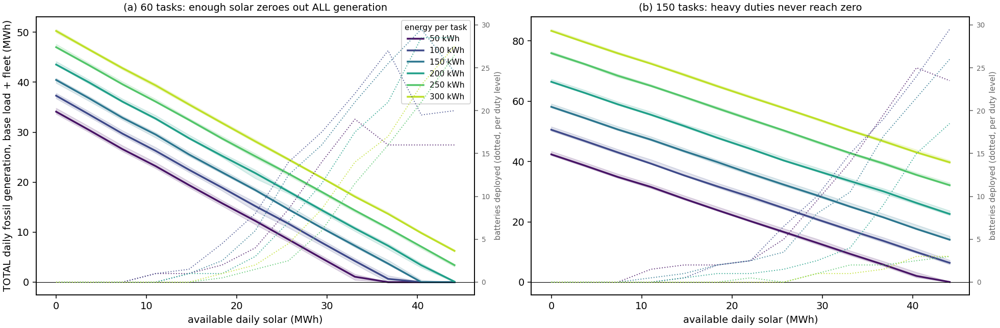

**Figure 8.6.** Total daily fossil generation (base load + fleet) versus available solar, for six task-energy levels (eps = energy one 2-hour task consumes: 50 kWh ~ a light shuttle run, up to 300 kWh ~ heavy off-road/patrol duty). Lines are medians over random trip sets and cloud-shape perturbations; shading is the spread. Every duty level shows the same concavity -- each additional MWh of solar displaces less fuel than the last (the empirical signature of Theorem 1's fixed-profile submodularity). Whether a curve REACHES zero (the whole microgrid running on time-shifted solar) depends on the surplus-vs-fleet-appetite balance: at 60 tasks (a) every duty level eventually zeroes out, while at 150 tasks (b) the heavier duties consume the surplus themselves and generation plateaus above zero -- the same boundary that the starred cells trace through Table 8.4. The dotted line (right axis) shows deployed storage growing as fuel falls: more solar is captured by more batteries, but each captures less -- the two halves of the diminishing-returns mechanism (dotted lines are color-matched to their duty level).

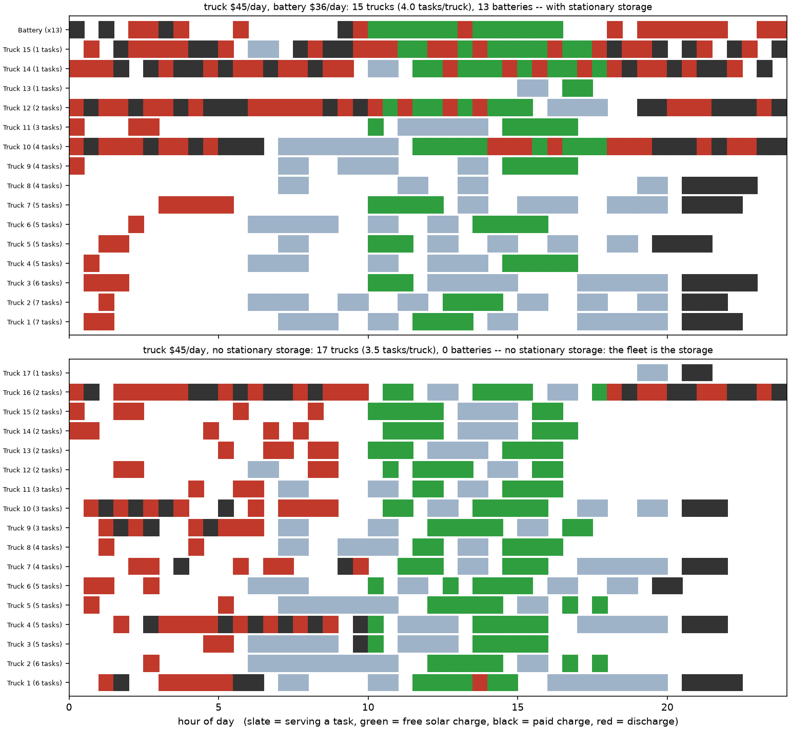

**Figure 8.7.** A realistic solution timeline: 60 one-hour tasks on a full-day schedule (6h-20h), so vehicles chain tasks the way real fleets do, instead of the breaks-schedule ceiling of ~4-5 two-hour tasks. Top: a depot WITH stationary storage -- the batteries carry the arbitrage and trucks mostly just recharge their own traction. Bottom: the same depot with NO stationary storage installed (a common real situation): the V2G-capable fleet takes over the arbitrage itself, and the truck lanes fill with discharge. Low-task lanes that charge across many blocks and discharge into both peaks are genuine fleet-as-storage vehicles, not artifacts: a representative optimal schedule (gap < 0.01%). Green cells are charging on free midday surplus, black is paid charging, red is V2G discharge into the morning/evening deficits.

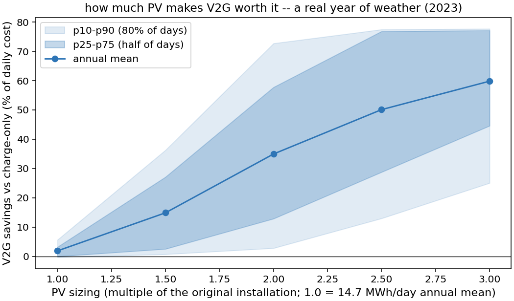

**Figure 8.8.** Annual V2G value as a function of PV build-out, evaluated on all 365 real days of 2023 irradiance at the site's coordinates (each day solved to optimality with and without V2G). At the original installation's sizing (1.0x) V2G is worthless every day of the year -- the site sits in the R < 0.4 dead zone even in June -- so V2G is only sensible as a JOINT decision with PV expansion. The payoff rises steeply over 1.5-2.5x, but note the risk profile: at 2.0x the mean is 31% while the 10th percentile is just 2% (cloudy-season days earn nothing); the value only becomes FIRM at ~3x, where even the 10th-percentile day saves 19%. The annual mean closely matches the mean-day design value at every sizing, so expected value can be estimated from a single average day -- but the day-to-day distribution cannot.

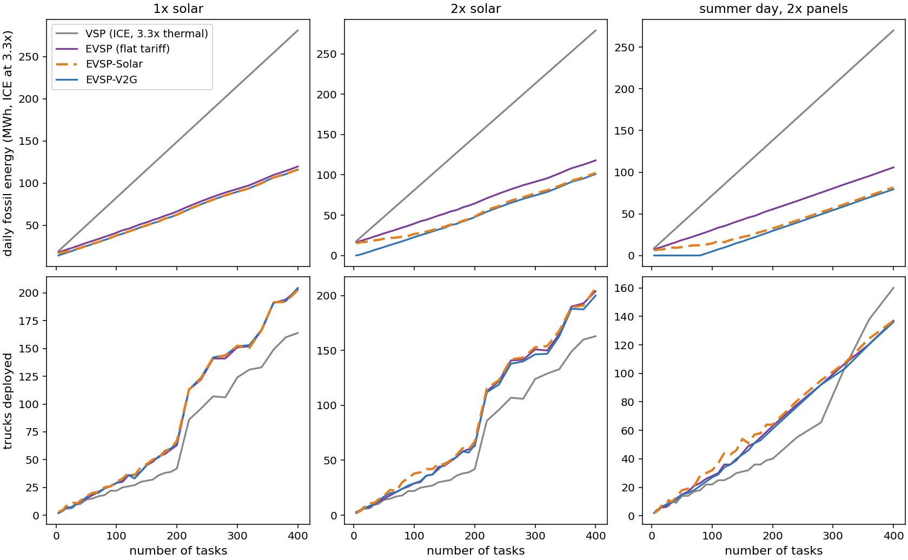

**Figure 8.9.** Fuel and fleet size versus workload, 20-400 tasks, at the original solar level (left) and doubled solar (right), honest drivetrain accounting. At 1x solar the Solar and V2G curves COINCIDE -- the site is in the R < 0.4 dead zone, so bidirectionality has nothing to arbitrage (dashed orange under solid blue); at 2x solar they separate and the V2G fuel curve pulls away. The fleet panel carries the operational story: charge-only fleets grow fastest with workload, while V2G's storage flexibility keeps the fleet closer to the ICE baseline.

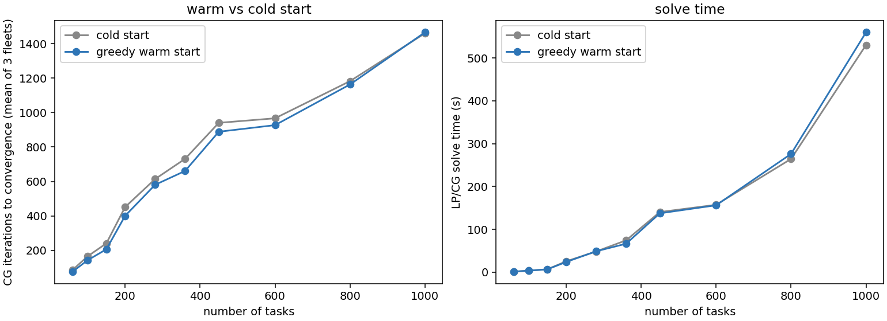

**Figure 8.10.** Column generation with the greedy warm start (repeatedly pricing against uncovered-task rewards -- the constructive counterpart of the submodular layer of Section 6) versus a cold start from single-task columns, means over three random fleets per size, 60-450 tasks. Either way the LP converges in seconds-to-a-minute on open-source solvers with no monolithic time-indexed MILP; the warm start's advantage in iterations grows with instance size.

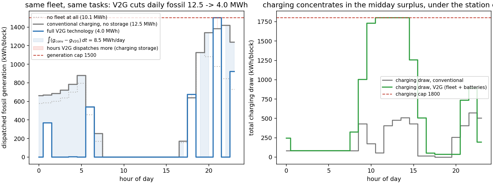

**Figure 8.11.** The infrastructure limits of Section 3, enforced and at work (realistic capped instance, 20 tasks, 24 MWh/day solar). Left: hourly fossil dispatch for the SAME fleet and tasks under conventional charging (gray) versus full V2G technology (blue): the morning and evening peaks are shaved and the daily fossil integral falls by roughly two thirds; the V2G solution's evening peak presses the generation cap exactly, so the reported benefits hold WITH the limits binding rather than absent. The dotted trace is the no-fleet base load for reference. Right: total charging draw (fleet plus batteries) -- the V2G solution pulls a large midday hump of free solar and stays under the station capacity cap, whose congestion price nu_t is exactly the term the pricing DP of Section 7 charges for charging. The shaded area between the curves is the saved energy, sum_t g_t taken over the day; charging is a continuous (linear) decision per block, so as the block length shrinks this sum converges to the integral of g(t) -- and the DP's complexity is linear in the number of blocks, making refinement computationally cheap.

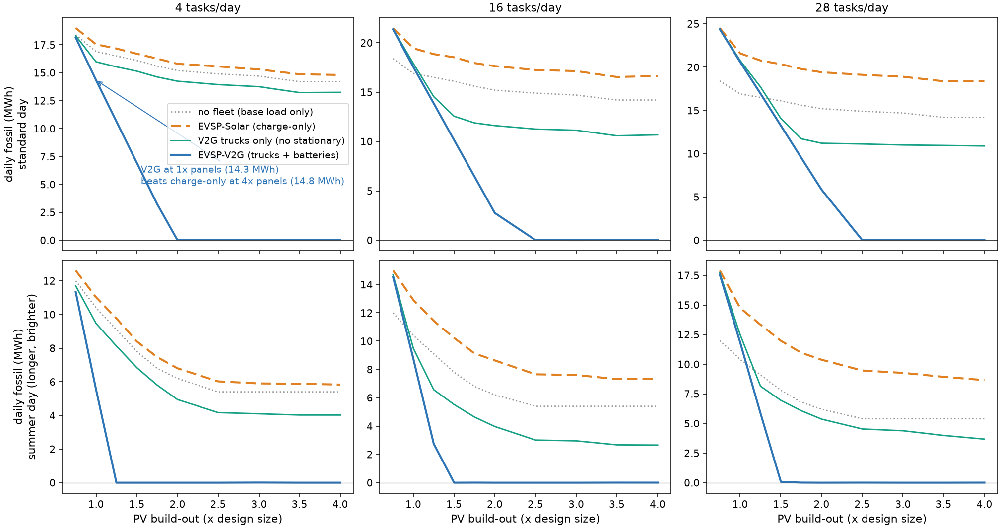

**Figure 8.12.** The corner of the design space where V2G shines: small fleets (4-20 daily tasks) under generous sun -- R runs 0 to 89, far beyond the saturation knee of Figure 8.5, in both panel build-out (0.75x-4x) and day length (bottom row: a summer day carrying 1.6x the solar energy over longer daylight). Mean of 3 random trip sets; same trips across every curve in a panel. The charge-only fleet (dashed orange) barely benefits from extra panels -- with no storage, midday surplus cannot reach the morning and evening base load, so its curve flattens toward a fossil floor. Bidirectional trucks alone (teal) shave a roughly constant slice limited by their pack capacity. The full V2G stack (blue) keeps converting every added panel into displaced fossil generation and reaches ZERO fossil in 858 of the sampled cells: the technology substitutes for panels (annotation), and past the point where charge-only saturates it is the only regime still buying anything with additional PV.

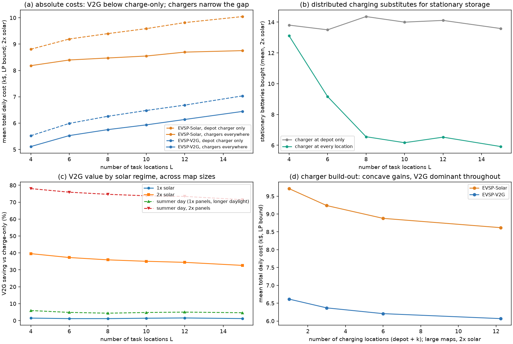

**Figure 8.13.** The multi-station model (Section 3's H0): 3,456 solves over L = 4-15 task locations on nested maps, four solar regimes, 40-160 one-hour tasks, 9 seeds, four charger-placement arms. All cost comparisons use the exact column-generation LP bound recovered from each stored run (the harder multi-station MILPs carry time-limit gaps, and filtering on gap would bias toward easy cells); battery counts are integer-solution values. Left: moving from a single depot charger to a charger at every task location saves total cost, and the saving grows with the size of the map; charge-only fleets gain as much as V2G fleets -- distributed charging is about reaching energy in time, not about bidirectionality. Second: with chargers everywhere the optimizer buys roughly half the stationary batteries at 2x solar -- opportunistic fleet charging substitutes for dedicated storage capex. Third: V2G's saving over charge-only by regime is flat in L -- the 1x dead zone and the sum2x bonanza are properties of the energy balance, not the network. Right: the charger build-out frontier on the large maps (L >= 8): the first two extra chargers capture most of the chargers-everywhere value, a concrete infrastructure-planning readout of the same diminishing-returns mechanism.

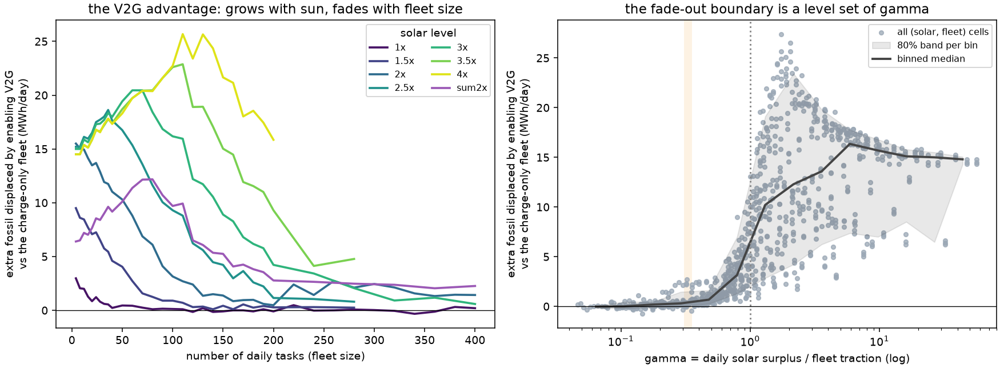

**Figure 8.14.** Where V2G beats charge-only, in the planner's coordinates. Left: the extra fossil energy V2G displaces beyond the charge-only fleet (median over seeds) against fleet size, one curve per solar level. Every curve has the same anatomy: the advantage rises while idle battery capacity can still reach unserved deficit, peaks, then fades as the fleet's own traction consumes the surplus -- and more sun moves the fade-out boundary to larger fleets (at 1x the advantage is never material; at 2x it fades past ~100-140 tasks; at 3x past ~300; at 4x it is still large at 200 tasks). Right: the same cells replotted against R = surplus/traction collapse onto one curve whose fade-out sits at the shaded band -- the SAME R* ~ 0.31-0.45 as the computed enablement break-even of Fig. 8.5. The (tasks x solar) boundary is a level set of R: a planner needs two energy audits, not a simulation, to know which side of it a base sits on.

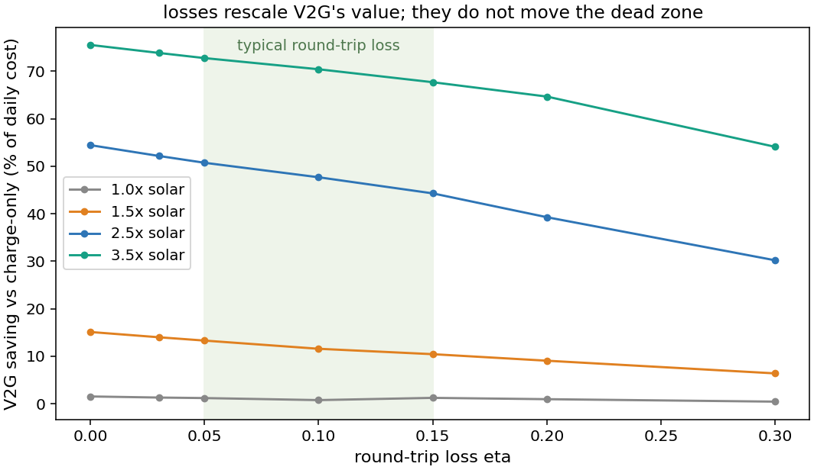

**Figure 8.15.** Sensitivity of the V2G value to the battery round-trip loss eta (mean over 20-120-task fleets, 2 seeds; every other experiment in this study uses the lossless base case, so this isolates the knob). In the dead zone (1x solar) the value is ~0 at every eta -- losses cannot kill what the energy balance already forbids -- while at mid and high solar each point of loss shaves value roughly linearly (at 2.5x: 54% lossless, 51% at the 5% loss of a modern LFP pack, 44% at 15%). Even at a punishing eta = 0.3, more than half the high-solar value survives. The R-rule's boundary is therefore loss-robust; only the height of the curve moves.

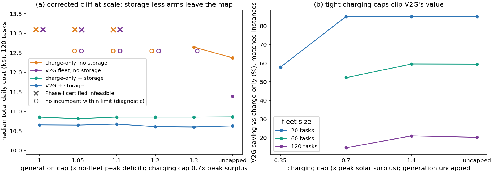

**Figure 8.16.** Infrastructure limits at pv = 2.5x, caps anchored to each instance's no-fleet peak deficit and peak solar surplus. (a) With a moderate charging cap, tightening the generation cap toward the no-fleet peak makes the charge-only fleet infeasible in every instance (any charging schedule pushes some block over the cap) while the V2G fleet keeps operating by discharging into its own charging peaks. (b) On matched feasible instances at uncapped generation, tighter charging caps monotonically clip V2G's saving by limiting how much surplus the fleet can absorb; gaps in a line mean the tighter cap left no feasible charge-only counterpart at that fleet size.

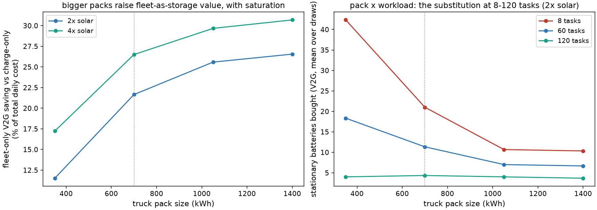

**Figure 8.17.** The truck pack as the fleet-as-storage capacity knob (8-120 tasks, 2 seeds, 350 kW charging; stationary-battery cost held fixed per kWh as pack size varies). Left: the value of fleet-only V2G (no stationary storage installed) over charge-only rises steeply from a 350 kWh pack to the 700 kWh baseline (dotted) and saturates by ~1 MWh -- consistent with Fig. 8.12's reading that bidirectional trucks alone shave a slice limited by pack capacity. Right: in the full V2G stack the optimizer's stationary-battery purchases fall by a factor of 4-5 as packs grow from 350 to 1400 kWh: pack capacity and stationary storage are direct substitutes, so the trend toward larger EV packs mechanically shrinks the dedicated-storage capex a microgrid needs.

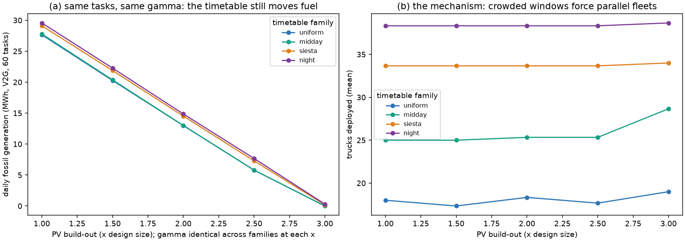

**Figure 8.18.** Retiming at fixed gamma: for each cell, one task set (locations and energies fixed) is timetabled four ways -- uniformly over the working day, concentrated outside the surplus window (siesta), at night, or INSIDE the surplus window (midday) -- so demand, solar, traction, and hence gamma are identical across families by construction. (a) Fuel still spreads by 5-15% at mid solar: scheduling is a real lever that gamma cannot see. Direction: under the cyclic model with storage available, the folk prescription of freeing the midday for charging INVERTS -- uniform beats siesta at every solar level, because storage already captures the surplus while window-crowding roughly doubles the fleet (b) and pushes recharging against the demand peaks.

**Parameter provenance** -- every empirical anchor used in this study:

| parameter | range used | source / anchor |
|---|---|---|
| fossil generation cost | $0.20-1.00/kWh | remote island / military-base diesel generation; the setting is a San Nicolas-style isolated base |
| EV truck daily cost | 1.0-2.0x ICE | ICCT (2023), TCO of alternative-powertrain long-haul trucks: BE truck MSRPs 1.3-2.4x diesel, TCO parity approaching 2030 (theicct.org) |
| EV drivetrain efficiency | 2.5-3.5x diesel | fleet telemetry: Class-8 BEVs ~1.7-2.1 kWh/mi vs ~6-7 mpg diesel at 37.7 kWh/gal (NACFE Run on Less - Electric) |
| stationary battery cost | $26-51/day per 700 kWh | LFP installed capex $200-400/kWh amortized over 15 years |
| bidirectional charger premium | $0-8/truck-day | V2G hardware $3-8k over unidirectional (industry guides, 2025-26); fleet DC units ~$15k (e.g. Fermata FE-20); DOE FEMP bidirectional-charging program; amortized 5-10 y |
| cycling degradation | $0-0.13/kWh discharged | Peterson, Apt & Whitacre (2010), J. Power Sources 195(8): classic V2G cell-degradation measurements; Sagaria, van der Kam & Bostrom (2025), Applied Energy 377: V2G adds 9-14% degradation over 10 years, fair compensation EUR 70-132/MWh (~$0.07-0.13/kWh) -- our sweep extends to $0.13; Uddin et al. (2017), Energy: smart control can reduce net degradation, consistent with our finding that the optimizer cycles less rather than pay |
| solar irradiance | 365 real days (2023) | Open-Meteo ERA5 archive, 33.25N 119.5W (CC-BY 4.0), hourly GHI |
| charge rate | 100-350 kW | commercial DC fast charging; 350 kW is today's deployed high end for trucks |
| task energy (eps) | 50-300 kWh per task | duty-cycle span: light shuttle to heavy off-road/patrol with auxiliary loads; the original paper's own two conversion factors (10 vs 33 kWh/gal) embed the 3.3x ratio |

